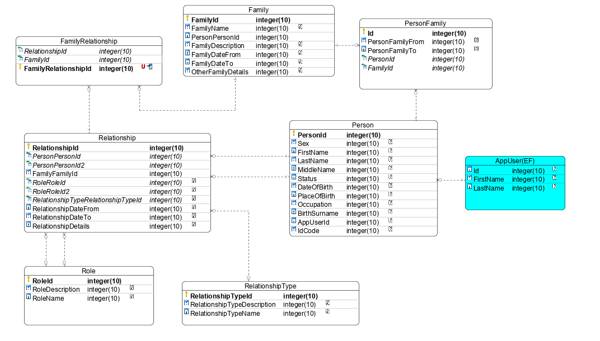

### Installing dependencies

```
cd WebApp
dotnet add package Microsoft.EntityFrameworkCore
dotnet add package Microsoft.EntityFrameworkCore.SqlServer
dotnet add package Microsoft.EntityFrameworkCore.Design
```

```
cd DAL.App.EF
dotnet add package Microsoft.EntityFrameworkCore
```

### Running migrations
These commands should be ran at the top level of your solution.
```
dotnet ef migrations add InitialDBDesign --project DAL.App.EF --startup-project WebApp
```


### Data model

