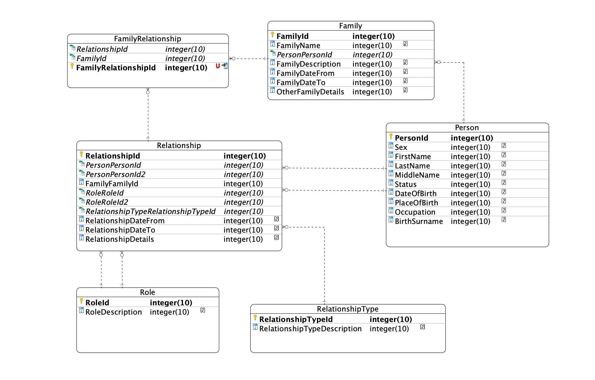

### Running docker 🐳

```
docker run -e 'ACCEPT_EULA=Y' -e 'SA_PASSWORD=Test@123' --rm --name mssql --publish 1433:1433 mcr.microsoft.com/mssql/server:2019-CU1-ubuntu-16.04
```

### Data model



### Installing dependencies

```
cd WebApp
dotnet add package Microsoft.EntityFrameworkCore
dotnet add package Microsoft.EntityFrameworkCore.SqlServer
dotnet add package Microsoft.EntityFrameworkCore.Design
dotnet add package Microsoft.VisualStudio.Web.CodeGeneration.Design
```

```
cd DAL.App.EF
dotnet add package Microsoft.EntityFrameworkCore
dotnet add package Microsoft.EntityFrameworkCore.Relational
dotnet add package Microsoft.EntityFrameworkCore.SqlServer

```

### Running migrations
These commands should be ran at the top level of your solution.
```
dotnet ef migrations add InitialDBDesign --project DAL.App.EF --startup-project WebApp
```

### Updating the database schema
```
dotnet ef database update --project DAL.App.EF --startup-project WebApp

// Removing the database
dotnet ef database drop --project DAL.App.EF --startup-project WebApp 
```

### Validating model with MVC
```
dotnet aspnet-codegenerator controller -name FamiliesController -actions -m Family -dc ApplicationDbContext -outDir Controllers --useDefaultLayout --useAsyncActions --referenceScriptLibraries -f
dotnet aspnet-codegenerator controller -name PersonsController -actions -m Person -dc ApplicationDbContext -outDir Controllers --useDefaultLayout --useAsyncActions --referenceScriptLibraries -f

dotnet aspnet-codegenerator controller -name RelationshipsController -actions -m Relationship -dc ApplicationDbContext -outDir Controllers --useDefaultLayout --useAsyncActions --referenceScriptLibraries -f
dotnet aspnet-codegenerator controller -name RelationshipTypesController -actions -m RelationshipType -dc ApplicationDbContext -outDir Controllers --useDefaultLayout --useAsyncActions --referenceScriptLibraries -f

dotnet aspnet-codegenerator controller -name RelationshipRolesController -actions -m RelationshipRole -dc ApplicationDbContext -outDir Controllers --useDefaultLayout --useAsyncActions --referenceScriptLibraries -f
dotnet aspnet-codegenerator controller -name FamilyRelationshipsController -actions -m FamilyRelationship -dc ApplicationDbContext -outDir Controllers --useDefaultLayout --useAsyncActions --referenceScriptLibraries -f
dotnet aspnet-codegenerator controller -name PersonFamiliesController -actions -m PersonFamily -dc ApplicationDbContext -outDir Controllers --useDefaultLayout --useAsyncActions --referenceScriptLibraries -f
```

### Generating base API-s
```

dotnet aspnet-codegenerator controller -name FamiliesController -actions -m Family -dc ApplicationDbContext -outDir ApiControllers -api --useAsyncActions  -f
dotnet aspnet-codegenerator controller -name PersonsController -actions -m Person -dc ApplicationDbContext -outDir ApiControllers -api --useAsyncActions  -f

dotnet aspnet-codegenerator controller -name RelationshipsController -actions -m Relationship -dc ApplicationDbContext -outDir ApiControllers -api --useAsyncActions  -f
dotnet aspnet-codegenerator controller -name RelationshipTypesController -actions -m RelationshipType -dc ApplicationDbContext -outDir ApiControllers -api --useAsyncActions  -f

dotnet aspnet-codegenerator controller -name RelationshipRolesController -actions -m RelationshipRole -dc ApplicationDbContext -outDir ApiControllers -api --useAsyncActions  -f
dotnet aspnet-codegenerator controller -name FamilyRelationshipsController -actions -m FamilyRelationship -dc ApplicationDbContext -outDir ApiControllers -api --useAsyncActions  -f
dotnet aspnet-codegenerator controller -name PersonFamiliesController -actions -m PersonFamily -dc ApplicationDbContext -outDir ApiControllers -api --useAsyncActions  -f

```


### Validating model with razorpages
```
dotnet aspnet-codegenerator razorpage -m Family -dc ApplicationDbContext -udl -outDir Pages/Families --referenceScriptLibraries -f
dotnet aspnet-codegenerator razorpage -m Person -dc ApplicationDbContext -udl -outDir Pages/Persons --referenceScriptLibraries -f
dotnet aspnet-codegenerator razorpage -m Relationship -dc ApplicationDbContext -udl -outDir Pages/Relationships --referenceScriptLibraries -f
dotnet aspnet-codegenerator razorpage -m RelationshipType -dc ApplicationDbContext -udl -outDir Pages/RelationshipTypes --referenceScriptLibraries -f
dotnet aspnet-codegenerator razorpage -m RelationshipRole -dc ApplicationDbContext -udl -outDir Pages/Roles --referenceScriptLibraries -f
dotnet aspnet-codegenerator razorpage -m FamilyRelationship -dc ApplicationDbContext -udl -outDir Pages/FamilyRelationships --referenceScriptLibraries -f
dotnet aspnet-codegenerator razorpage -m PersonFamily -dc ApplicationDbContext -udl -outDir Pages/PersonFamilies --referenceScriptLibraries -f
```

### Generating login and signup forms
```
dotnet aspnet-codegenerator identity -dc DAL.App.EF.ApplicationDbContext -f
```


### Todo

- [x] Currently does not generate GUIDs for Persons.
- [x] Family should have many people.
- [x] Relationship should many families.

